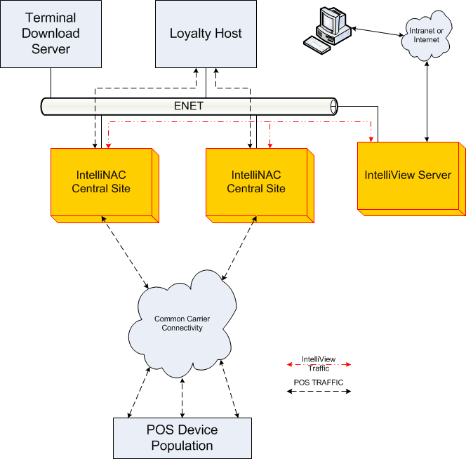
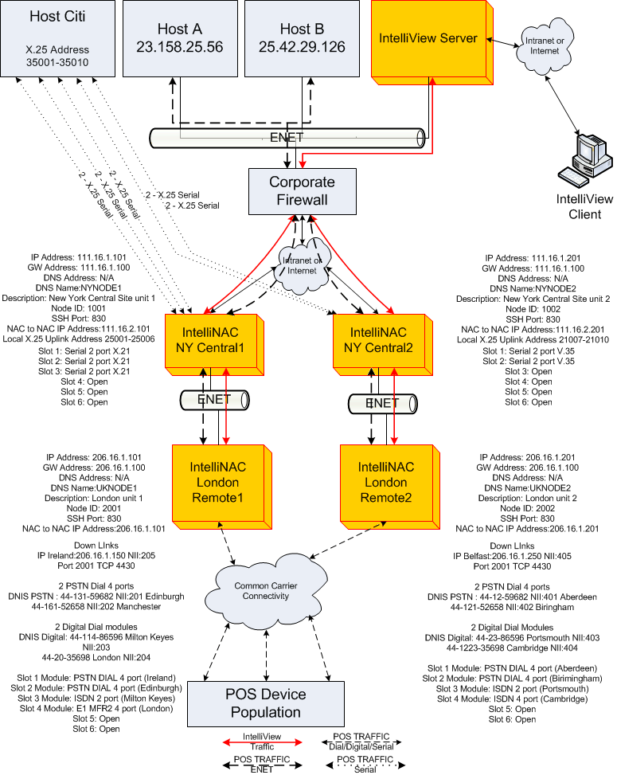
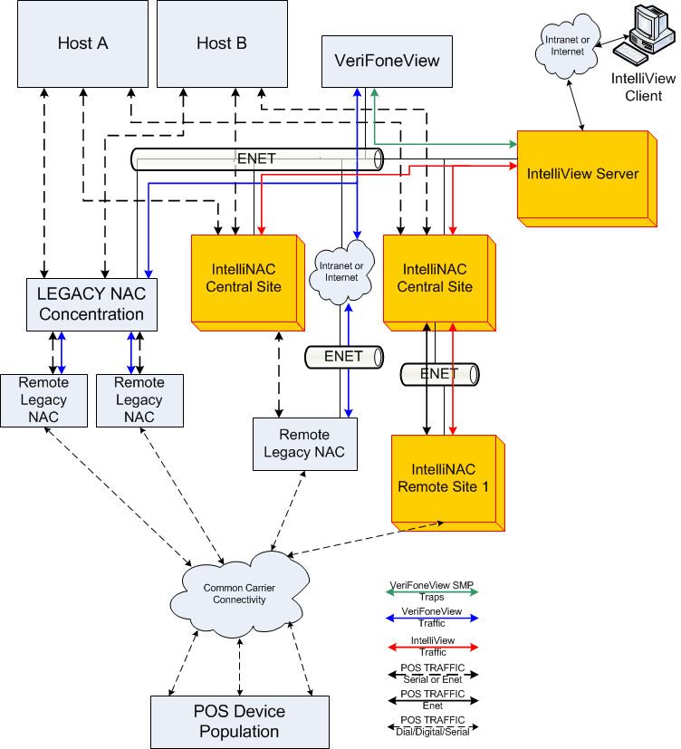

wing use cases illustrate various network scenarios. They are not all inclusive, but
provide a few basic as well as advanced approaches for network configurations. Each network is
unique, so please use these samples as examples as you design your custom configuration.
The use cases fall in the following categories:
### General Use
### Specific Use
**General Use**

The general use cases include:

- Planning for Management:
    - Planning for the IntelliView Server (Platform, IT consideration for access)
    - Planning for number of instances of IntelliView   
    - Planning for IntelliView access from co-located IntelliNACs
    - Planning for IntelliView access from remote IntelliNACs
    - Planning for database access (logs, statistics, and trace)
    - Planning for upgrade process for IntelliView
    - Planning for upgrade process for IntelliNACs
    - Planning for database backup
    - Planning for SNMP event logging from VeriFoneView
    - Planning for statistics reporting
    - Planning for notifications (email, SMS txt)
- Planing for general configuration: 
    - Planning for node definition (offline versus real time) 
    - Planning for standards of definition (node ID, labels, map views) 
- Planning for deployment: 
    - Planning for staging the IntelliNACs (pre-staged at central customer center) 
    - Planning for deployment (network topology) 
    - Planning for IntelliNAC data center installation (rack and environmental requirements) 
    - Planning for WAN connectivity (WAN design, carrier provisioning) 
    - Planning for host connectivity (protocols in use, density per node, physical connections) 
    - Planning for downlink connectivity (protocols in use, density per node, access methods,carrier provisioning) 
- Planning for Security:
    - Planning for user class and privileges
    - Planning for secure browser access
    - Planning for SSL certificate management (SSL downlink/uplink, WAN)
    - Planning for use of EFTSec
    - Planning for use of LDAP
    - Planning for secure installation (SSL BMC)

**Specific Use**

The specific use cases include:

- Planning for Operation:
    - Planning for access routing criteria (DNIS, Embedded TPDU, Default, Content)
    - Planning for NII-based routes (directed, load balanced, failover)
    - Planning for uplink types (X.25, SNA, IP)
    - Planning for downlink types (X.25, IP, Dial)
- Planning for Configuration:
    - Planning for configuration of downlinks (protocol selection and options, connection options)
    - Planning for configuration of uplinks (protocol selection and options, connection options)
    - Planning for configuration of WAN (connection options, security options)

Format: 

Format: 

Format: 
