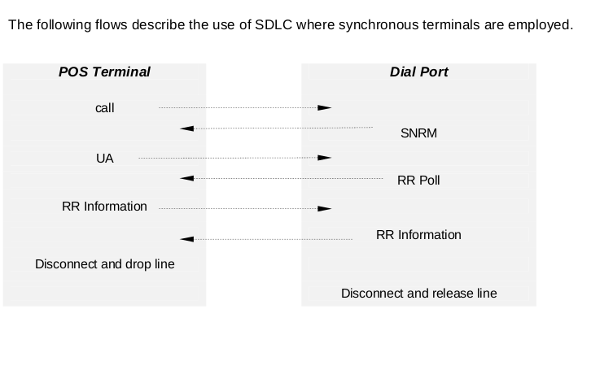

# Types of SDLC frame

[a link](http://www.euclideanspace.com/coms/protocol/sdlc/)

###I Information
I frames are numbered. The Ns count provides for numbering the frame being sent and the Nr provides acknowledgement for the I frames received. When duplex ifformation exchange is in continual process, each station reports its current Ns and/or Nr counts in each I or S frame exchanged. 

## Supervisory frames
### RR - Receive Ready
Sent by either a primary or secondary station, RR confirms numbered frames through Nr-1 and indicates that the originating station is ready to receive. 

### RNR - Receive Not Ready
Sent by either a primary or secondary station, RNR indicates a temporarily busy condition due to buffering or other internal constraints. 

### REJ - Reject
This command/response may be transmitted to request transmission or retransmission of numbered information frames. REJ confirms frames through Nr-1 and requests the retransmission of numbered information frames starting ae Nr contained in the REJ frame. 

## Unnumbered Format
### UI - unnumbered Information
As a command or a response, a UI frame is the vehicle for transmitting unnumbered information. 

### SNRM - set normal response mode
This command places the secondary station in normal response mode (NRM) for information transfer. UA is the expected response. The primary and secondary station Nr and Ns counts are reset to 0. No unsolicited transmissions are allowed from a secondary station that is in NRM. The secondary station remains in NRM until it receives a DISC or SIM command. 

### DISC - Disconnect
This command terminates other modes and places the receiving (secondary) staton in disconnected mode. The expected response is UA. A secondary station in disconnected mode cannot receive or transmit information or supervisory frames. 

### RD - Request Disconnect
This request is sent by a secondary station desiring to be disconnected (by the DISC command) 

### UA - Unnumbered Acknowledgment
This is the affirmative response to an SNRM, DISC or SIM command 

### RIM - Request Initialisation Mode
A RIM frame is transmitted by a secondary station to notify the primary station of the need for a SIM command

### SIM - Set Initialisation Mode
This command initiates system-specified procedures for the purpose of initialising link-level functions. UA is the expected response. The primary and secondary Nr and Ns counts are reset to 0. 

### DM - Disconnected Mode
This response is transmitted by the secondary station to indicate that it is in the disconnected mode. 

###FRMR - Frame Reject
This response is transmitted by a secondary station in NRM only when it receives an invalid frame. A received frame may be invalid for several reasons:
- its C field is not implemented at the receiving station. This category includes unassigned commands.
- the information field is too long to fit the receiving station buffers
- The C field in the received frame does not allow an I field to be received with the frame.
- The Nr that was received from the primary station is invalid. 

### TEST - test
As a command, a test frame may be sent to a secondary station in any mode to solicit a TEST response. If an information field is included with the command it is returned in the response. 

### XID - Exchange station Identification
As a command, XID solicits the identification of the receiving (secondary) station. An information field may be included in the frame to convey identification of the transmitting (primary) station. An XID response is required from the secondary station. An information field in the response may be used for identification of the responding secondary station. 

